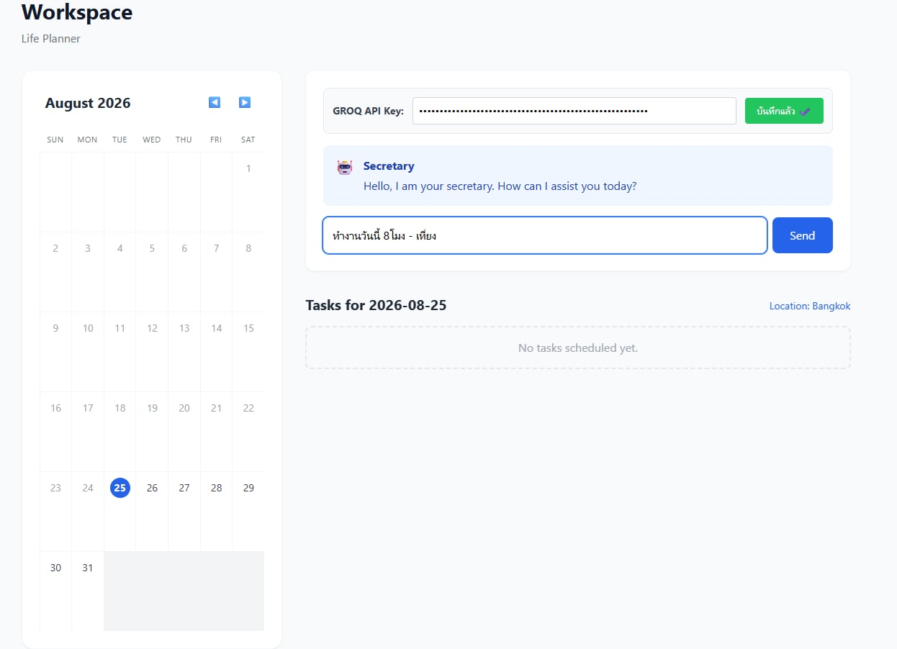
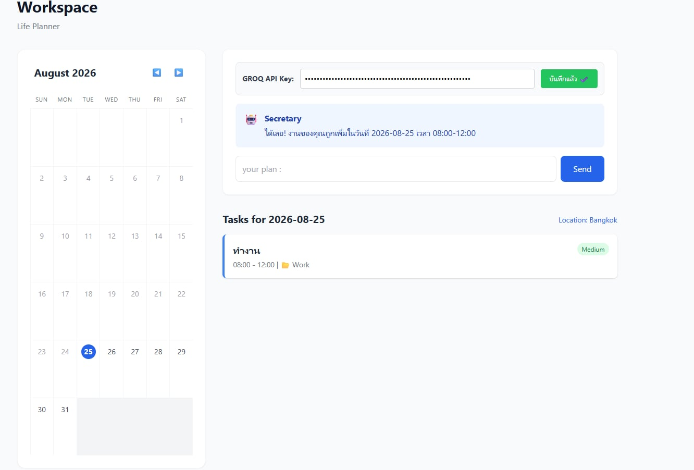
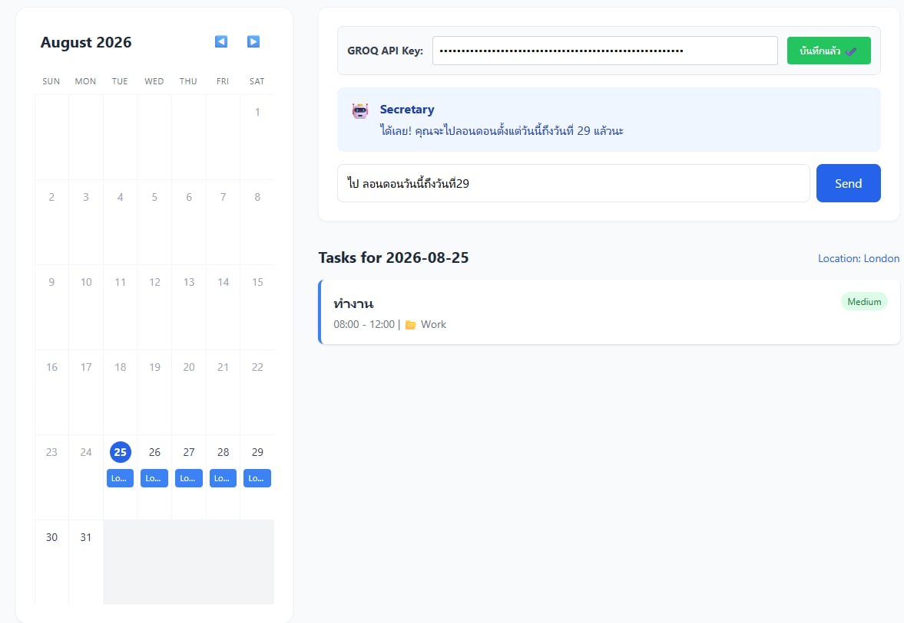

# LifePlannerByTyping

# 🗓️ Workspace - Life Planner

An AI Life Planner application that automatically organizes your daily tasks and locations using natural language. 

## 🚀 Tech Stack
* **Frontend:** React + Tailwind CSS
* **Backend:** FastAPI (Python)
* **Database:** SQLite
* **AI Engine:** Groq API (LLM)

## 🛠️ Prerequisites (สิ่งที่ต้องมีในเครื่อง)
* **Groq API Key** (สามารถสมัครฟรีได้ที่ [console.groq.com](https://console.groq.com/))

---

## 🏃‍♂️ How to Run (วิธีรันโปรเจกต์)
* รันผ่าน docker
### Prerequisites
* ตรวจสอบให้แน่ใจว่าติดตั้ง [Docker](https://www.docker.com/) และ **Docker Compose** ในเครื่องแล้ว

เปิด Terminal ในโฟลเดอร์โปรเจกต์หลัก แล้วรันคำสั่ง:

```bash
docker-compose up -d --build
```
Example



